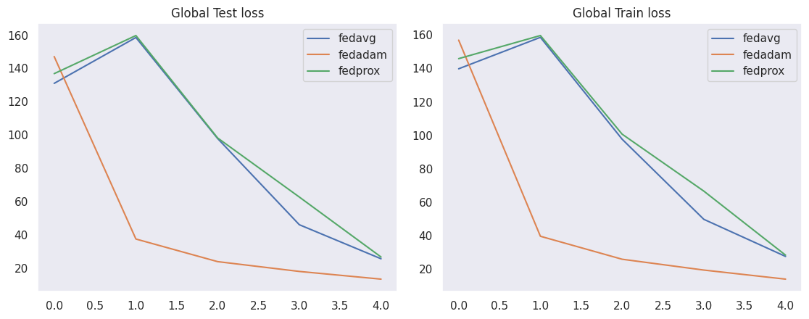
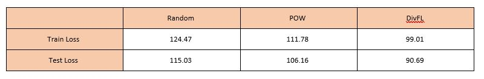

# Traffic Forecasting with Time Series Analysis
In this project, Long Short Term Memory (LSTM) model is used to predict future values of the cell loads, based on a specified previous window.The following table shows th architecture of LSTM network.

| PARAMETER            | Value                                 |
|----------------------|---------------------------------------|
| LSTM regression model| Sequential (TensorFlow)     |
| Input Neurons        | 24x4 = 96                             |
| Output Neurons       | 1                                     |
| Number of hidden layers | 4                                  |
| Hidden units per layer | 50                                  |
| Dropout Rate         | 20%                                   |
| Optimizer            | Adam                                  |
| Learning rate        | 0.01                                  |
| Feature scaling      | MinMaxScaler (sklearn library)        |
| Training epochs      | 20                                    |
| Batch size           | 64                                    |
| Loss function        | Mean Squared Error                    |

# Centralized 
In this scenario, we train one model for all cells. The following figure shows that this model cannot predict the cell load accurately. 

# Individual
In this scenario, we train one model for each cell individually. The following figure shows that this model can predict the cell load accurately. 
 

# Federated Learning
In this approach, we aim to use federated learning to train one global model for the cells. In this scenario, we implement FedAvg, FedProx, and FedADAM algorithms from scratch. Additionally, we use FGSM, and PGD algorithms for robustness.

- **FedAvg**: The server aggregates the local updates (weights) to update the global model based on the weighted average.

  $
  W_{\text{global}} = \frac{\sum_{k=1}^{K} n_k W_k}{\sum_{k=1}^{K} n_k}
  $

- **FedProx**: It is an extension of the FedAvg algorithm, designed to improve the robustness and efficiency of federated learning, especially in heterogeneous environments (non-IID). FedProx adds a regularization term to the local loss (optimization problem) of each client. The addition of the $\frac{\mu}{2} \|w_k - w\|^2$ term encourages the local models to stay closer to the global model, mitigating the effects of statistical heterogeneity across clients. The local update rule in FedProx can be formulated as follows:

   $$
   \min_{w_k} F_k(w_k) + \frac{\mu}{2} \|w_k - w\|^2
   $$

- **FedADAM**: An adaptation of the Adam optimization algorithm for federated learning environments, which aims to improve the convergence and stability of training across a distributed network of clients. The summary of this algorithm is shown in the following figure. More details are available in [2].

  

- **FGSM**: Fast Gradient Sign Method is a technique for adversarial attacks and for implementing defense mechanisms. The basic idea behind FGSM is to create perturbed inputs $x'$ from original inputs $x$ by applying a perturbation $η$ in the direction of the sign of the gradient of the loss function $L$ with respect to $x$.

  $
  \text{{Adversarial example: } } x_{\text{{adv}}} = x + \epsilon \cdot \text{{sign}}(\nabla_x J(\theta, x, y))
  $

- **PGD**: Projected Gradient Descent attack is an iterative adversarial attack method that enhances the effectiveness of generating adversarial examples compared to the one-step FGSM.

   $
   \text{{Adversarial example:} } x_{\text{{adv}}}^{(t+1)} = \text{{Clip}}_{x, \epsilon}\left( x_{\text{{adv}}}^{(t)} + \alpha \cdot \text{{sign}}(\nabla_x J(\theta, x_{\text{{adv}}}^{(t)}, y)) \right)
   $

The results show that global loss decreased faster in FedADAM. More results such as the impact of FGSM and PGD attacks can be found in the code.

The following table shows the summary of the results.

# Fully Distributed Federated Learning
In this scenario, we suppose there is no central server to aggregate model updates from clients. Instead, it leverages peer-to-peer communication among the nodes to achieve consensus and update the global model collaboratively.

We use the $A$ adjacency matrix to determine cell neighbours.

$
A =
\begin{bmatrix}
	1 & 0 & 1 & 0 & 1 \\
	0 & 1 & 0 & 1 & 1 \\
	1 & 0 & 1 & 1 & 0 \\
	0 & 1 & 1 & 1 & 0 \\
	1 & 1 & 0 & 0 & 1
\end{bmatrix}
$

We use three client selection methods in this implementation.

1. **Random**: In this method, each client randomly chooses a subset of available clients to participate in each round of training. In other words, each participating client evaluates and assigns a weight to the contributions (model updates) from its neighboring clients during the model aggregation process. 

2. **PoW**:  Power-of-Choice client selection strategy is a biasing of the client selection towards clients with higher local losses. For more information [3]

   $
   S^{(t+1)} = \arg\max_{x_k \in \mathcal{K}} F_k(\tilde{W}^{(t)})
   $

3. **DivFL**: Diverse Client Selection is for Federated Learning via Submodular Maximization. Specifically, each client selects a subset of its neighbors to maximize a submodular facility location function, which is defined within the context of gradient space. For more information [4]

In this implementation, we use Targeted FGSM and Target PGD attacks. More details about these attacks and another proposed attack are available in [5].

$
	x_{\text{{adv,dta}}} = x_0 - \epsilon \cdot \text{{sign}}(\nabla_x L(\theta, x, y + \alpha \cdot \text{{sign}}(\nabla_x L(\theta, x, y))))
	\newline
	x^{n}_{\text{{adv}}} = \Pi_{\mathcal{X}}(x^{n-1} - \epsilon \cdot \nabla_x L(\theta, x^{n-1}, y))
$

All graphs are available in code and you can find the impact of client selection, attack, and robustness algorithms in code. The two following tables show the comprehensive overview of their outcomes.

# References

1. A. Giannopoulos et al., "Supporting Intelligence in Disaggregated Open Radio Access Networks: Architectural Principles, AI/ML Workflow, and Use Cases," in IEEE Access, vol. 10, pp. 39580-39595, 2022, doi: 10.1109/ACCESS.2022.3166160.

2. Reddi, S., Charles, Z., Zaheer, M., Garrett, Z., Rush, K., Konečný, J., ... & McMahan, H. B. (2020). Adaptive federated optimization. arXiv preprint arXiv:2003.00295.

3. Cho, Yae Jee, Jianyu Wang, and Gauri Joshi. "Client selection in federated learning: Convergence analysis and power-of-choice selection strategies." arXiv preprint arXiv:2010.01243 (2020).

4. Balakrishnan, R., Li, T., Zhou, T., Himayat, N., Smith, V., & Bilmes, J. (2022). Diverse Client Selection for Federated Learning via Submodular Maximization. *International Conference on Learning Representations*. [Access here](https://openreview.net/forum?id=nwKXyFvaUm)

5. Govindarajulu, Y., Amballa, A., Kulkarni, P., & Parmar, M. (2023). Targeted Attacks on Timeseries Forecasting. arXiv preprint arXiv:2301.11544.