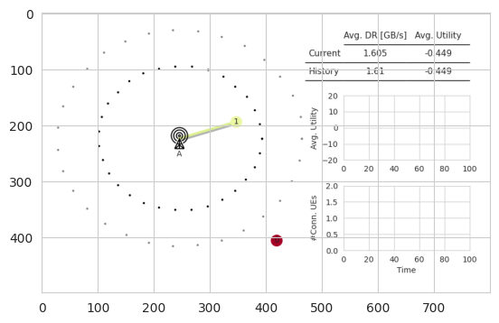
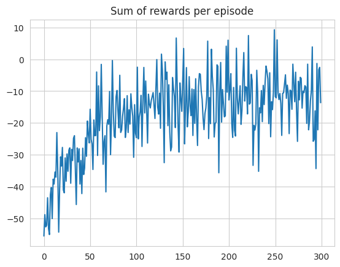
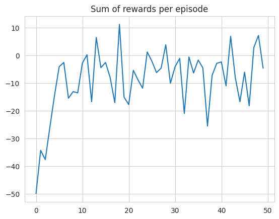
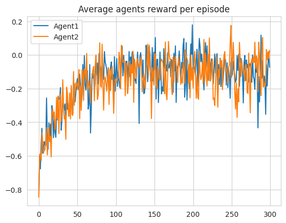
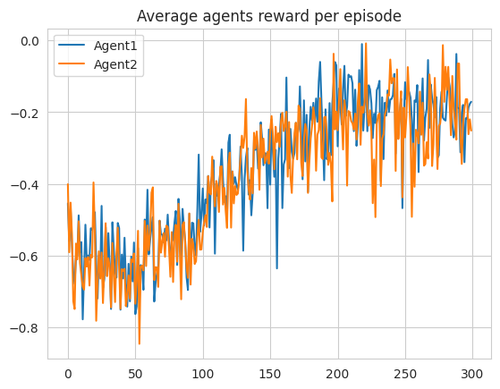
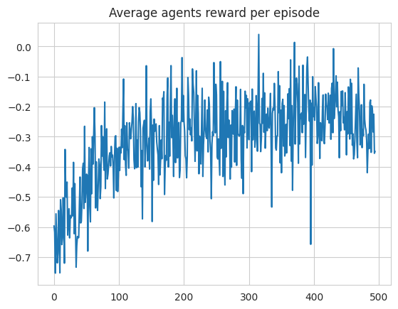

# Environment
[Mobile-env](https://github.com/stefanbschneider/mobile-env) is used as the simulated RAN environment that implements an openAI Gymnasium interface. Developed in Python, this environment is accessible for installation via PyPi. It offers a simulated RAN setting, allowing for the customization of various scenarios that include different network configurations, such as moving users, multiple base stations, varying frequencies, and more. In our specific test scenario, we have configured the environment to include a BS and 2 moving UEs.
The following figure shows the environment with BS and its coverage ranges. The connections between UEs and BSs are depicted through lines, and the colors signify the users' quality of experience (QoE): green for a good QoE and red for a poor QoE.

# Reinforcement Learning
In this project, The Q-learning and Deep Actor-Critic algorithms are implemented. Both converge but the deep actor-critic method converges faster.

## Q-learing
Q-learning is a model-free reinforcement learning algorithm to learn the value of an action in a particular state. These Q-values are stored in a table, known as a Q-table, which the agent consults to decide the best action to take next.

Q-value Update:

$ Q(s, a) \leftarrow (1 - \alpha) Q(s, a) + \alpha [r + \gamma \max_{a'} Q(s', a') ] $

$\epsilon$-Greedy:

$
\pi(a|s) = 
\begin{cases} 
	1 - \epsilon + \frac{\epsilon}{|\mathcal{A}(s)|} & \text{if } a = \arg\max_{a'} Q(s, a') \\
	\frac{\epsilon}{|\mathcal{A}(s)|} & \text{otherwise}
\end{cases}
$

## Deep Actor-Critic
it combines the ideas of value-based and policy-based RL approaches, leveraging neural networks to approximate both policy (actor) and value functions (critic). The actor decides which action to take given the current state. The critic assesses the quality of the actions taken by the actor by predicting the expected returns. The critic updates its value function based on the temporal difference (TD) error and its goal is to minimize this error. The actor updates its policy in the direction suggested by the critic.

$
L_{\text{actor}} = -\log(\pi(a|s)) \cdot \text{TD\_error}
$

$
L_{\text{critic}} = \left( r + \gamma \cdot \text{critic}(\text{next\_state}) - \text{critic}(\text{state}) \right)^2
$

# Multi-Agent Reinforcement Learning
In this scenario, each UE is an RL agent that acts in parallel. For more information please read the reference [2].

## Minimax Q learning
This algorithm designed to handle competitive environments. It adapts the Q-learning framework to consider the worst-case scenario (minimizing opponent) at each step, leading to a strategy that performs well under the assumption that the opponent is playing optimally.

$
V_1(s) \leftarrow \max_{\pi \in \Pi(A_1)} \min_{a_2 \in A_2} \sum_{a_1 \in A_1} \pi(a_1) Q_1(s, (a_1, a_2))
$

## Belief based
One alternative is to explicitly maintain a belief regarding the likelihood of the other agents’ policies, and update V based the induced expectation of the Q values. F could be pdf estimator such as Histogram (frequency) and KNN.

$
V_i(s) \leftarrow \max_{a_i} \sum_{a_{-i} \in A_{-i}} P(s, a_{-i}) Q_i(s, (a_i, a_{-i})).
$

## Distributed Q-learning
It works in deterministic problem and Under the conditions that the reward function is positive and $Q_{i,0} = 0 \forall	 i$, the local policies 
of the agents provably converge to an optimal joint policy with respect to global Q.

The local Q-values are updated only when the update leads to an increase in the Q-value.

$
Q_{i, k+1}(x_k, u_{i,k}) = \max \left( Q_{i,k}(x_k, u_{i,k}), r_{k+1} + \gamma \max_{u_i} Q_{i,k}(x_{k+1}, u_i) \right).
$

The local policy is updated only if the update leads to an improvement in the Q-values.

$
\bar{h}_{i,k+1}(x_k) = 
\begin{cases}
	u_{i,k} & \text{if } \max_{u_i} Q_{i,k+1}(x_k, u_i) > \max_{u_i} Q_{i,k}(x_k, u_i), \\
	\bar{h}_{i,k}(x_k) & \text{otherwise}.
\end{cases}
$

# References
1. S. Schneider, S. Werner, R. Khalili, A. Hecker and H. Karl, "mobile-env: An Open Platform for Reinforcement Learning in Wireless Mobile Networks," NOMS 2022-2022 IEEE/IFIP Network Operations and Management Symposium, Budapest, Hungary, 2022, pp. 1-3, doi: 10.1109/NOMS54207.2022.9789886.
2. S. Schneider, H. Karl, R. Khalili and A. Hecker, "Multi-Agent Deep Reinforcement Learning for Coordinated Multipoint in Mobile Networks," in IEEE Transactions on Network and Service Management, vol. 21, no. 1, pp. 908-924, Feb. 2024, doi: 10.1109/TNSM.2023.3300962.
3. L. Busoniu, R. Babuska and B. De Schutter, "A Comprehensive Survey of Multiagent Reinforcement Learning," in IEEE Transactions on Systems, Man, and Cybernetics, Part C (Applications and Reviews), vol. 38, no. 2, pp. 156-172, March 2008, doi: 10.1109/TSMCC.2007.913919.
